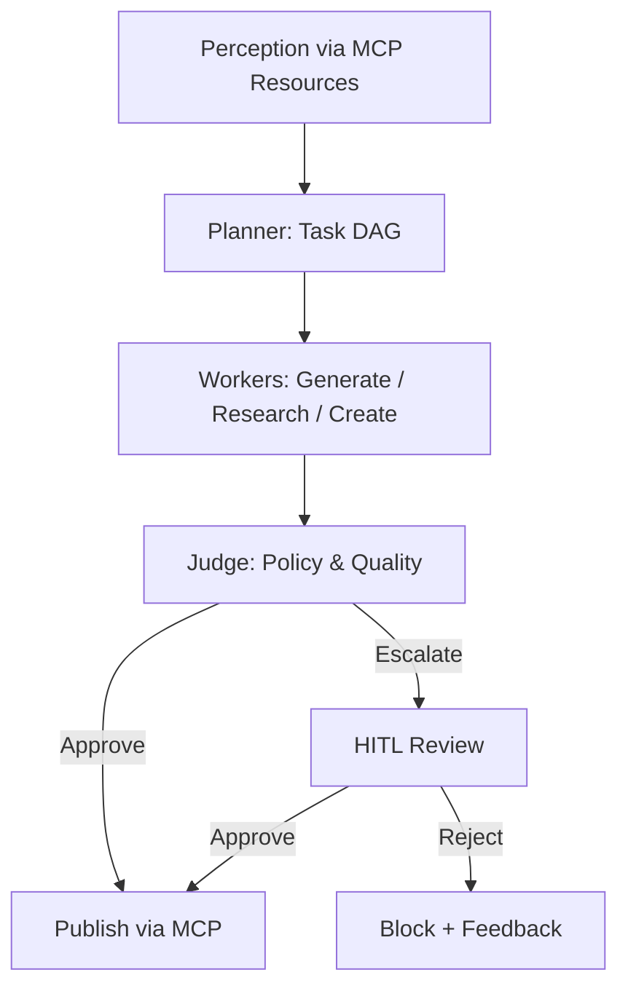
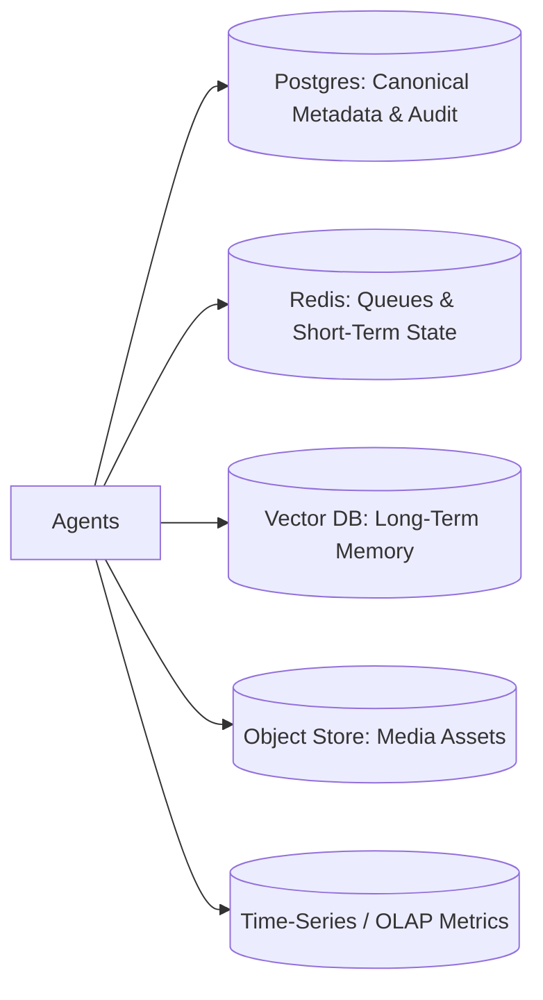

# Project Chimera — Domain Architecture Strategy

> **Task 2 Deliverable (3‑Day Challenge)**
> Role: Lead Architect / Governor
> Methodology: Spec‑Driven Development (SDD)

---

## 1. Purpose of This Document

This document defines the **high‑level architectural strategy** for Project Chimera, based directly on the Project Chimera SRS. It establishes the **agent pattern**, **safety & human‑in‑the‑loop (HITL) model**, and **data architecture choices** that will govern all downstream specifications and implementation work.

This document is intentionally **implementation‑agnostic**. Its goal is to remove ambiguity so that future agents (human or AI) can safely and consistently build the system.

---

## 2. Architectural Goals (Derived from SRS)

From the SRS, Chimera must:

* Operate **at scale** (many agents, many concurrent tasks)
* Support **true autonomy** without fragile prompt chains
* Enforce **governance, safety, and auditability**
* Remain **extensible** as platforms, models, and tools evolve
* Enable **economic agency** (agent wallets & transactions)

These constraints rule out monolithic or purely sequential designs.

---

## 3. Agent Pattern Selection

### 3.1 Chosen Pattern: **Hierarchical Swarm (Planner → Worker → Judge)**

**Decision:** Project Chimera SHALL use a **Hierarchical Swarm architecture**, composed of specialized agent roles:

* **Planner** – decomposes goals into task graphs (DAGs)
* **Worker** – executes atomic tasks (generation, research, posting, etc.)
* **Judge** – validates outputs, enforces policy, and commits state

### 3.2 Why Not a Sequential Chain?

A Sequential Chain fails Chimera’s requirements because it:

* Does not scale horizontally
* Couples reasoning, execution, and validation
* Makes safety and rollback difficult
* Becomes fragile as workflows grow

Sequential chains MAY exist **inside a Worker** for small, deterministic steps, but MUST NOT define system‑level orchestration.

### 3.3 Benefits of the Swarm Pattern

* Parallel execution of content, engagement, and analytics
* Fault isolation (failed tasks do not corrupt global state)
* Clear governance boundary (Judge)
* Natural insertion point for HITL and compliance

---

## 4. Human‑in‑the‑Loop (Safety Layer)

### 4.1 Core Principle

Humans SHALL NOT be embedded in every step.
Humans SHALL intervene **only at defined risk boundaries**.

This follows the SRS philosophy of *management by exception*.

### 4.2 HITL Approval Boundaries

Human approval is enforced **at the Judge layer**, never inside Workers.

#### Mandatory HITL Gates

1. **Content Publication Gate**

   * Politics, health, finance, legal, crisis events
   * Brand‑sensitive or reputation‑impacting content

2. **Engagement / Reply Gate**

   * Low confidence intent detection
   * Adversarial or manipulative interactions
   * External links or calls‑to‑action

3. **Persona & Memory Mutation Gate**

   * Permanent persona changes (SOUL.md)
   * Long‑term memory writes with identity impact

4. **Agentic Commerce Gate**

   * Transactions above policy thresholds
   * New counterparties or token deployments

### 4.3 Approval Decision Matrix

| Risk   | Confidence | Action                  |
| ------ | ---------- | ----------------------- |
| Low    | High       | Auto‑approve            |
| Medium | Any        | HITL review             |
| High   | Any        | HITL mandatory or block |

---

## 5. Data Architecture: SQL vs NoSQL

### 5.1 Key Insight

“Video metadata” contains **two fundamentally different data classes**:

1. **Canonical system‑of‑record data**
2. **High‑velocity analytical events**

They SHALL NOT be stored in the same way.

---

### 5.2 System of Record: **SQL (Postgres)**

**Postgres SHALL be the authoritative datastore** for:

* Video / asset metadata
* Agent, campaign, and platform relationships
* Publish state and moderation state
* Approval history and audits
* Versioning and traceability

**Why SQL:**

* Strong relational integrity
* ACID guarantees
* Auditable history (non‑negotiable for governance)

---

### 5.3 High‑Velocity Metrics: **Event / Time‑Series Store**

High‑frequency data such as:

* Views, likes, watch time
* Engagement deltas per interval
* Impression curves

SHALL be stored in a **time‑series or OLAP‑optimized system**, such as:

* TimescaleDB (preferred for simplicity)
* ClickHouse / BigQuery (at larger scale)

### 5.4 Role of NoSQL

NoSQL systems MAY be used for:

* Caching and queues (Redis)
* Raw platform payload archival

NoSQL SHALL NOT be the primary system of record.

---

## 6. High‑Level System Flow

### 6.1 Content Lifecycle (Planner → Worker → Judge)

---

### 6.2 Data Layout

---

## 7. Architectural Positioning Summary

**Chosen Architecture:**

* Hierarchical Swarm agents
* Judge‑centric governance
* HITL at explicit safety gates
* SQL as truth, events for scale
* MCP as the sole integration boundary

This architecture directly reflects the SRS intent: to build a **reliable factory for autonomous influencers**, not a brittle demo.

---
