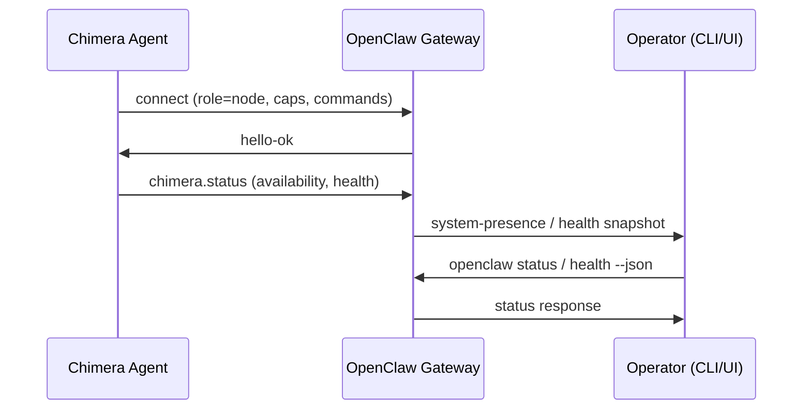

# Project Chimera — OpenClaw Integration

**Spec-ID**: CHIMERA-OPENCLAW-001  
**Spec-Status**: DRAFT  
**Ratified-By**: TODO  
**Ratified-On**: TODO  
**Autonomy-Approval**: true  
**Allowed-Tools**: ["openclaw_gateway_ws"]  
**Rate-Limits**: {"status_publish": "1/min per agent"}  
**Safety-Constraints**: {"allowed_endpoints": ["configured_gateway_url"], "credential_scope": "read-only status publish"}

---

## 1. Purpose

This spec defines how Project Chimera agents **publish their Availability and Status** to the OpenClaw network, enabling:

- Discovery by other OpenClaw nodes and operators
- Health monitoring via `openclaw status` and `openclaw health --json`
- Integration with OpenClaw Gateway as a control plane

---

## 2. OpenClaw Protocol Summary

From [OpenClaw Gateway Protocol](https://docs.clawd.bot/gateway/protocol):

- **Transport**: WebSocket, text frames, JSON payloads
- **Handshake**: First frame MUST be `connect` request with `role`, `scopes`, `client` identity
- **Roles**: `operator` (control plane) or `node` (capability host)
- **Presence**: `system-presence` returns entries keyed by device identity
- **Health**: `openclaw health --json` queries Gateway for full health snapshot via WebSocket

---

## 3. Chimera as OpenClaw Node

### 3.1 Role Declaration

Chimera agents connecting to OpenClaw SHALL declare:

| Field    | Value |
|----------|-------|
| `role`   | `node` |
| `client.id` | `chimera-agent` |
| `client.version` | Semver (e.g., `0.1.0`) |
| `client.platform` | `chimera` |
| `client.mode` | `node` |

### 3.2 Capability Claims

Chimera nodes declare capabilities at connect time:

```json
{
  "caps": ["content", "engagement", "analytics"],
  "commands": [
    "content.generate",
    "content.publish",
    "engagement.fetch",
    "analytics.metrics"
  ],
  "permissions": {
    "content.publish": "hitl_gated",
    "engagement.reply": "hitl_gated"
  }
}
```

---

## 4. Availability / Status Payload

### 4.1 Status Schema

Chimera SHALL publish a status payload compatible with OpenClaw expectations:

```json
{
  "type": "event",
  "event": "chimera.status",
  "payload": {
    "agent_id": "uuid",
    "agent_version": "0.1.0",
    "availability": "available | busy | maintenance",
    "capabilities": ["content", "engagement", "analytics"],
    "health": {
      "status": "healthy | degraded | unhealthy",
      "checks": {
        "postgres": "ok",
        "redis": "ok",
        "mcp_tools": "ok"
      },
      "updated_at": "2026-02-06T12:00:00Z"
    },
    "current_load": {
      "active_tasks": 3,
      "queue_depth": 10
    }
  }
}
```

### 4.2 Publish Frequency

- **Heartbeat**: Every 15 seconds (align with Gateway `tickIntervalMs`)
- **On state change**: Immediately when `availability` or `health.status` changes
- **Rate limit**: Max 1 status publish per 10 seconds per agent (avoid flooding)

---

## 5. Integration Flow



---

## 6. Implementation Notes

### 6.1 Connection Lifecycle

1. **Connect**: Chimera establishes WebSocket to configured `OPENCLAW_GATEWAY_URL`
2. **Auth**: Use `OPENCLAW_GATEWAY_TOKEN` or device token from pairing
3. **Handshake**: Send `connect` with Chimera node params
4. **Status loop**: Publish `chimera.status` on interval and on state change
5. **Reconnect**: On disconnect, exponential backoff (1s, 2s, 4s, max 60s)

### 6.2 Health Checks

Chimera SHALL implement internal health checks before publishing:

- Postgres connectivity
- Redis connectivity
- MCP tool availability (at least one platform adapter)

If any check fails, set `health.status` to `degraded` or `unhealthy`.

### 6.3 Gateway Discovery

- **Local**: `ws://localhost:18789` (default OpenClaw Gateway port)
- **Remote**: Configure via `OPENCLAW_GATEWAY_URL` env var
- **TLS**: Use `--tls-fingerprint` or `gateway.remote.tlsFingerprint` when connecting over TLS

---

## 7. Traceability

Per Constitution Section 6, all status publishes MUST emit trace events:

```json
{
  "timestamp": "2026-02-06T12:00:00Z",
  "actor_id": "chimera-agent-uuid",
  "spec_id": "CHIMERA-OPENCLAW-001",
  "call_id": "uuid",
  "endpoint": "openclaw_gateway_ws",
  "outcome": "success"
}
```

---

## 8. Optional vs Required

This integration is **optional**. Chimera core functionality does NOT depend on OpenClaw. When OpenClaw Gateway is not configured:

- Chimera operates in standalone mode
- No status publish attempts
- No connection errors (graceful no-op)
